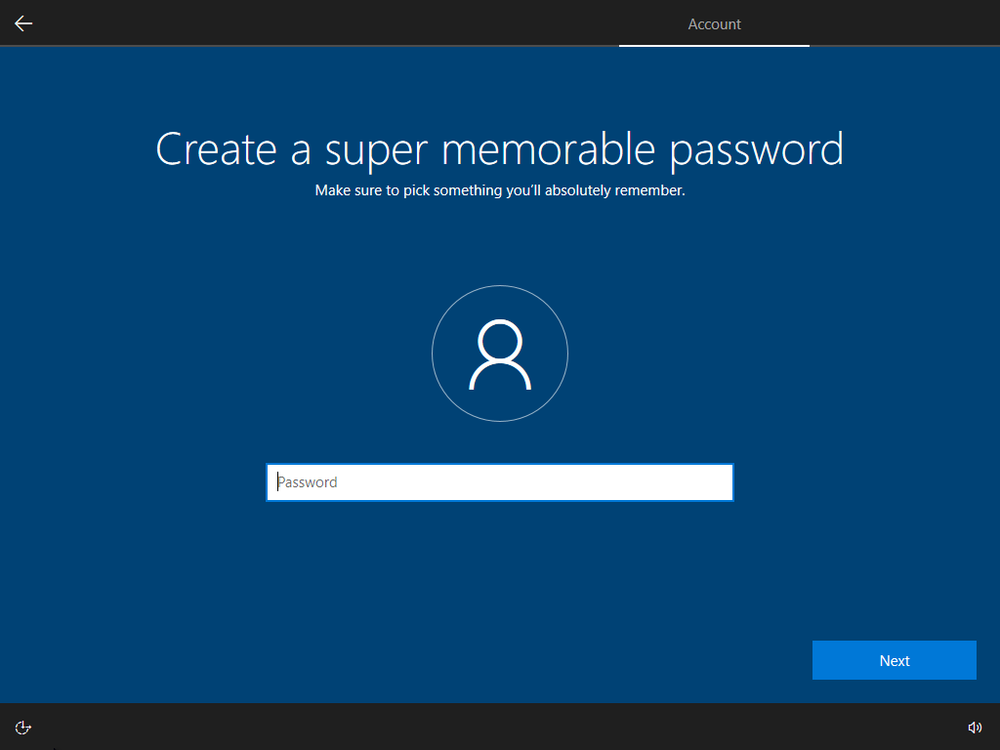

import Kbd from '@site/src/components/Kbd';
import Admonition from '@theme/Admonition';

# How to install ReviOS

In this guide you will see how to install ReviOS (or any Windows for that matter).

We discuss here the installation of ReviOS with a **USB drive** (or usually called a flash drive in the guide). This guide also mentions a way to boot into the installer without a USB drive, but the main method is to use a flash drive. Another way is to use the script of iidanL, [InstallWindowsWithoutUSB](https://github.com/iidanL/InstallWindowsWithoutUSB). We do not support this method of installing, use it at your own risk. (TLDR: It sets up your new Windows to dual boot.)

## Step 0: Preparations

### BIOS vs UEFI, MBR vs GPT

First, if you do not know if your PC is capable of UEFI booting, please consult your motherboard's or laptop's manual. 

Or go into your BIOS, you can do that ususally by spamming the <kbd>F2</kbd> or <kbd>Del</kbd> button when your PC is starting up. If it has a graphical interface that you can use with your mouse and not *hurting your eyes to look at*, you most likely have UEFI. In every other scenario, you probably have BIOS.

Just to be sure, inside the booting menu, and search for a setting where you can switch between option usually called "UEFI" or "Extended" and "Legacy" or "BIOS".

These technologies usually come in pair, like UEFI and GPT or BIOS and MBR. And while you could switch things up, like UEFI and MBR or BIOS and GPT, it is not recommended. Here, for example, the UEFI and GPT pair means UEFI boot mode on GPT partitions. Also, UEFI systems usually backward compatible and can boot in Legacy mode, often called CSM. If your system have CSM, it is recommended to switch it off, because the booting probably will be done in Legacy or BIOS mode otherwise.

<Admonition type="tip custom-admonition windows" icon={<i class="fa-solid fa-memo-pad"></i>} title="TLDR">
  <p>
    In short, if your PC is <b>capable of</b> booting in <b>UEFI</b> mode, we recommend <b>selecting GPT</b>, if not, select MBR later on in the step <a href="#step-2-making-a-bootable-flash-drive">Making a bootable flash drive</a>.
  </p> 
</Admonition>

### Drivers

The second recommended thing to do before doing any other thing, is to download your drivers, at least your **network drivers**. It is much easier to just download the driver before reinstalling, rather than booting into your new installation of ReviOS, and realizing you have no internet, and to download your driver for internet, you need internet.

If you do not know how to download your driver, we can give you a general idea, but the manufacturer's websites are not the same. 

The fastest way to find the drivers you need, just **Google** "<*the name of your motherboard or laptop*> drivers", of course without the `<` and `>` symbols. Click the search result which takes you to the **website of the manufacturer** of your device. There find the drivers, probably under the **Support section** or something like that.

After you accuired your drivers, should take them with yourself on the installation **flash drive**. So you need to **copy** the files **after the** [**2nd step**](#step-1-download-revios), but before the [3rd](#step-3-booting-the-flash-drive)

Alternatively, and <u>this method should not be considered the default option</u>, download the network drivers with Snappy Driver Installer Origin and take the whole folder of it with you before you format your partition(s). Help on this method can be found on the [How to install drivers page](/faq/drivers).  

### Check what drives and partitions you have

The third thing recommended thing before installing, is to check what drives and partitions you have. More specifically, how are they identified.

<Admonition type="tip custom-admonition dev" icon={<i class="fa-light fa-lightbulb"></i>} title="Tip">
  <p>
    Before getting into that, let me explain how this whole drives and partitions thing works.
    <p></p>
    You have in your PC one or more drives. Those can be SSD or HDD, but for this explaination does not matter.
    <p></p>
    And on one drive you have one or more partitions. This guide mostly talks about partitions.
  </p>
</Admonition>


<Admonition type="tip custom-admonition info" icon={<i class="fa-light fa-note-sticky"></i>} title="Note">
<p>
Windows uses the terms "disk" and "drive" interchangeably. So they mean the same.
</p>
</Admonition>

Open `Disk Management` by right-clicking on the Start menu icon, and selecting it.

Should look like this:


The **recommended** way to do the installation is to at least **format** (or more like delete and recreate, you will see it at [Installing](#)) the **partitions storing the OS**. Usually the partition that was called C: by the Windows on it, and other **System** and **Reserved** and **Recovery** partitions. Additionally, you can format your other partitions too, but **make sure you backed up everything**.

<Admonition type="tip custom-admonition dev" icon={<i class="fa-light fa-lightbulb"></i>} title="Tip">
  <p>
  Additional advice is if you are worried you could not identify your partitions inside the installer, take note of the sizes and the number of them. If you have multiple partitions with the same size, take note of the free space, too.
  </p>
</Admonition>

<Admonition type="tip custom-admonition info" icon={<i class="fa-light fa-note-sticky"></i>} title="Note">
<p>
  Take for an example the picture above.

  Here I have two drives, with the first having 3 partitions, and the second only one. This is a common setup, where the user has a drive which holds the OS, and another drive for everything else, e.g. data, movies, games.

  I would note the following:
          
  Need to be deleted:
  <ul>
    <li>System Reserved partition, Disk 0 Partion 1, size: 50 MB</li>
    <li>the main partition of Windows (C:), Disk 0 Partion 2, size: 49.48 GB</li>
    <li>Recovery partion, Disk 0 Partion 3, size: 475 MB</li>
  </ul>

  Free to do whatever you want:
  <ul>
    <li>data partition, Disk 1 Partition 1, size: 100 GB</li>
  </ul>
</p>
</Admonition>

Another example would be if you have similar like on the picture but basically the D: 100 GB partition is on the first disk, not on the second. Here again I would note almost the same, execept the data partition is Disk 0, not 1; and Partition 4, not 1.

<Admonition type="tip custom-admonition windows" icon={<i class="fa-solid fa-memo-pad"></i>} title="TLDR">
  <p>
  To reiterate, you will need to delete all OS partitions, not just the C: partition, but every system, reserved, recovery, etc. partitions too. These you can easily identify by the small, an only couple of megabytes size of them.
  </p>
</Admonition>

### Backup

<Admonition type="tip custom-admonition warning" icon={<i class="fa-solid fa-hexagon-exclamation fa-lg"></i>} title="Danger">
  <p>
    This Windows installing process will delete your previous OS, so you should back up everything you plan on seeing again in the future. At least have separate partition to save your data. Or you can move your things to a flash drive, even the installing flash drive, just after the <a href="#step-2-making-a-bootable-flash-drive">2nd step</a>, but before the <a href="#step-3-booting-the-flash-drive">3rd</a>
  </p>
</Admonition>

## Step 1: Download ReviOS

You can find our supported versions on the [Download page](/downloads).

Here download the the `Clean Installation` option of the version of your choice. Help about choosing the right ReviOS: [What is the difference between the versions?](/faq/related/difference)

### Verification

<Admonition type="tip custom-admonition warning" icon={<i class="fa-solid fa-triangle-exclamation fa-lg"></i>} title="Attention">
  <p>
    This step is very important, it can save you a lot of time in the future.
  </p>
</Admonition>

```mdx-code-block
import Tabs from '@theme/Tabs';
import TabItem from '@theme/TabItem';

<Tabs>
<TabItem value="Automatic Method">

  Using an automatic tool made by [Stasium](https://github.com/StasiumDev/), you can automatically verify the downloaded ISO. You can download it [here](https://github.com/StasiumDev/ReviOS-Verifier/releases). 
  
  After downloading the .zip file, extract it to a location of your choice. Here you will see a `revi-verifier.exe` file. Drag the downloaded Revi ISO onto this program. It will scan the file and check if it has downloaded successfully. 
  
  If the program reports an error with the file, you should download the ISO again, preferrably from another source. Multiple alternative sources can be found on the [Revision Discord](https://discord.gg/962y4pU).

</TabItem>
<TabItem value="Manual Method">

  On Windows, go in the File Explorer where you downloaded the ISO file, and <Kbd special="shift">Shift</Kbd>+<Kbd>Right-click</Kbd> on an empty space of the window, and select Open PowerShell window here. Type in the following command:

      Get-FileHash -Algorithm MD5 -Path <file name>    

  And replace the `<file name>` part with the name of the ReviOS installer file's name. **You can use the <Kbd special="tab">TAB</Kbd> button to autocomplete the file name.** For example: 
`Get-FileHash -Algorithm MD5 -Path .\ReviOS-10-22.10.iso`

  When the command returns with the hash of the file, compare it to the corresponding MD5 hash value on the [Verification page](/downloads/verification). If they are the same, your ISO file is not corrupted, you can carry on with the process.

</TabItem>
</Tabs>
```

<hr></hr>


## Step 2: Making a bootable flash drive

### Ventoy

<!--What makes Ventoy a better choice over Rufus is that you can use it on Linux too, and it's much easier.-->

<Admonition type="tip custom-admonition danger" icon={<i class="fa-solid fa-hexagon-exclamation fa-lg"></i>} title="Warning">
  <p>
  This method will <b>wipe everything</b> from your flash drive. If you want to see the contents of it in the future, <b>make a backup</b>. You can copy back the contents of the flash driver after Ventoy did it's thing. The partition probably will be named <code>Ventoy</code>.
  </p>
</Admonition>

<Admonition type="tip custom-admonition windows" icon={<i class="fa-solid fa-memo-pad"></i>} title="TLDR: on how Ventoy works">
  <p>
  With Ventoy, you don't need to format the flash drive over and over, you just need to copy the image files to the USB drive and boot them directly. You can copy many files at a time and ventoy will give you a boot menu to select them.
  And actually you will boot a hidden partition, with the sufficient software to boot up an image file after you select it.
  </p>
</Admonition>

You can download Ventoy on the [official website of the software](https://www.ventoy.net/en/download.html).

You do not need to install Ventoy, after extracting the zip file, just open `Ventoy2Disk.exe`.

Should look something like this:


**Select** your **USB device** from the **dropdown menu**. If it is not present, in the `Option` menu select the `Show All Devices` option to show everything. But be sure to select the right device in the dropdown menu, because with this enabled, every storage device will be listed!

Select the partition style/scheme of your choice from **Options**, **Partition Style**. More detail in [BIOS vs UEFI, MBR vs GPT section](#bios-vs-uefi-mbr-vs-gpt)


Additionally, you can select the `Secure Boot Support`, especially if you have Windows 11 and plan on playing with games or anti-cheat that require it.

Now click on the `Install` button.

After the software finishes, you can close the window.

You can now **copy** the ReviOS installer **ISO** file to the partition of the **flash drive**, called `Ventoy`.

On Linux, the method of using Ventoy should be the same.

<!--
### Rufus

You can download Rufus [here](https://rufus.ie/).

Like Ventoy, this software also does not need installation. Should look like this, after opening the EXE file:


Here, first select your flash drive under the `Device` dropdown menu. If it is not present, click `Show advanced drive properties`, and tick `List USB Hard Drives`.

Then select the ISO file by clicking on the `SELECT` button.

With ReviOS 10 the only thing you need to do before starting to prepare your flash drive is to decide MBR or GPT you will use. If you do not what are those, this guide wrote in detail about it [above](#bios-vs-uefi-mbr-vs-gpt).

Should look something like this with ReviOS 10:


With ReviOS 11 select GPT. There is one more thing to look out for, and make sure you do not change it, no matter what hardware you have. It is the `Image option`. Again, it does not matter that you have TPM or not, ==**do not change this option from `Standard` to `Extended`**==, because the ReviOS installer will not work!

Should look something like this with ReviOS 11:


Now you can start the preparation, by clicking the `START` button
-->


### If you do not have a USB drive

...on Windows you can go into Disk Management, select one of your partitions that have atleast 4 to 5 gigabytes of free space. <kbd>Right-Click</kbd> on that partition, and select `Shrink Volume...`. Then a window asks how many space do you want to cut of that partition, in megabytes. Write in 5120, but at least the size of the ISO file times 1024 plus 100.

A new partition will pop up. <kbd>Right-Click</kbd> on it, and select `New Simple Volume...`. A setup wizard will appear, there you can select the letter and name of the partition, although those have not much relevance.

If you are done, the formatted partition will be ready for you to extract the contents of the ISO file. If you went with this method, the following steps should be the same, just this guide will call your partition with the installer's file a flash drive, not a partition.

## Step 3: Booting the flash drive

<!-- To boot into your flash drive, open `Start menu`, click on `Power`, and then hold ++shift++ and click on `Restart`. This way, a full screen menu should come up looking like this:


There if you have the option `Use a device`, click it, and then the option with the name of your flash drive or `EFI USB Device`. -->

### Boot menu

First **consult the manual** of your motherboard or laptop, and find out **which key** is the **Boot Menu**.

When you restart your PC, after it shutdown, and just started to boot up again, start **spamming that key** until the menu opens.

A list should come up with options to boot. Also, usually the last option is to enter BIOS. Here, choose the option with the **name of your flash drive**. If you have multiple options with the name of it, choose that boots in UEFI mode, if you selected GPT when preparing the flash drive. Or if it does not show the names, only USB Drive and Optical Drive and Hard Drive, something like those, obviously choose the USB Drive like option.

### Boot order changing in BIOS

Alternatively you can go inside your BIOS settings, and change the boot order. This is a list that tells the BIOS what to boot. So when your PC boots, BIOS trys to boot from the first option from the list. If that is not working, it tries the second option, and so on.

:::note 

This option is not optimal, because if you are done with your Windows installation, but before booting the OS the first time, you have to change the boot order back in BIOS or remove the installer media, the flash drive, because you will boot into the installer again.

:::

## Step 4: Installing

If you have done everything good so far, and used Ventoy, a menu will be open with the option to select and image to run. It will look similar to this image:

<!-- todo -->
  
  Click on the picture to open it full size

  Source: [Ventoy website](https://www.ventoy.net/en/screenshot.html)
<!--  -->

Select the desired image file. If you used Ventoy the first time, only one entry will be in the list.

When the installer boots up, it should look something like this:


Accept the license terms, and then the disk selection step comes up. Here you have multiple choices, depending on the configuration you are using. 

### Partitions

<Admonition type="tip custom-admonition windows" icon={<i class="fa-light fa-note-sticky"></i>} title="Missing Driver">
  <p>
    When you arrive to the partition making and selecting part of the installing process, but the installer asks for drivers, you might need Intel Rapid Storage Technology (IRST) drivers. <a href="https://www.asus.com/support/FAQ/1044458/">Here is a helping guide from the Asus Support page.</a>
  </p>
</Admonition>

<Admonition type="tip custom-admonition warning" icon={<i class="fa-light fa-solid fa-triangle-exclamation fa-lg"></i>} title="Important">
  <p>
    This part of the setup relies on the knowledge of your drives, which we discuss at <a href="#check-what-drives-and-partitions-you-have">Check what drives and partitions you have section.</a>
  </p>
</Admonition>


Check what partitions your previous Windows installation uses, what you noted down, and delete those with the `Delete` button.

And then select the drive which used to store your previous Windows, and click `New`, write in the desired size of the new "C: partition" and add to that number 525 megabytes. If you are done, click `Apply`. 

If you did not change the number, it will create a new partition from the whole drive, and could and probably will make other, OS related partitions, as the pop-up window says: `To ensure that all Windows features work correctly, Windows might create additional partitions for system files.`

Additionally, if you want a clean start, you can format your other partitions too.

After you created the partitions you wanted, select the first you created, the one you meant for the OS, and click `Next`.

The installation started, you do not need to do anything for a while.

If the installer finishes, it will restart automatically.

Then the OS will load for a bit, with the text `Getting ready` on the screen.

Then it will restart again.


## Step 5: Windows post install setup

<Admonition type="tip custom-admonition info" icon={<i class="fa-light fa-note-sticky"></i>} title="Note">
  <p>
  On Windows 11 this section looks different but, the steps should be the same. Furthermore, in newer builds of ReviOS, we added the possibility to change the language and keyboard here. This tutorial does not reflect that, since the pictures has not been updated in a while.
  </p>
</Admonition>

After the last restart you should arrive at this screen, obviously here you have to choose a username:


And here a password. You can skip this question by just clicking on `Next`. 

<Admonition type="tip custom-admonition warning" icon={<i class="fa-light fa-solid fa-triangle-exclamation fa-lg"></i>} title="Caution">
  <p>
  Skipping this can lead to a bug and you won't be able to log in.
  </p>
</Admonition>



Here just press `Not now`. Even if you press `Accept`, Cortana probably will not work.


You are done with the Windows post install setup, the OS will load for some time.

## Step 6: Finishing the installation

After arriving at your desktop, first, **let the script that popped up run through**. **Do not do anything until the script restarts your PC**. If it is not closing, read [the section about this phenomenon](/faq/non-related/cmd).

After your PC boots up again, this guide have some recommendation to go through.

1. Activate your Windows with a valid Pro key. Help in the [ReviOS Post-Install guide](/post-install).

2. In `Settings` → `Time & Language` → `Language`, and add your language, even if you want to use Windows on English. To change your keyboard layout to non-English, you need to add that language. After that, you can change your regional format or keyboard layout or even what language Windows displays:
    
    

3. Set the time, because ReviOS's default is the UTC time zone. `Settings` → `Time & Language` → `Date & time`

4. Download and install your drivers. This guide discussed downloading and installing drivers before, in great detail, check it [here](#drivers), and you can find more help on the [How to install drivers page](/faq/drivers).

5. Go through the [ReviOS Post-Install guide on the Revision website](/post-install) guide. You do not need to do every step, you can skip any of them, but the Visual C++ Runtimes and DirectX installation is highly recommended.
