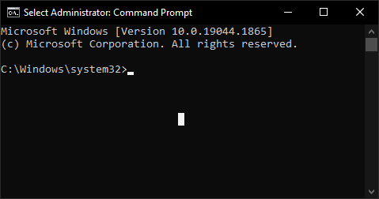

### The "Do not close the window, otherwise your system won't work properly" window not closing 

Make sure you did not select a character in the command prompt (a **white rectangle**). This puts the terminal window in selection mode and pauses the running of the script. **Press Esc** or Enter, and the script will continue. If you are not sure, but the window title has the `Select` word (see the example), it is definitely in selection mode.

Example image. The selection is in the middle of the terminal window