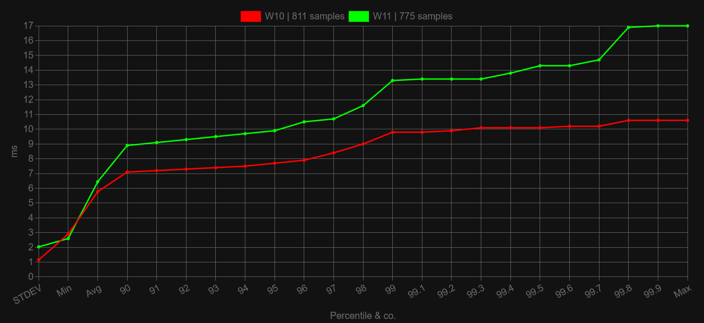

**For FACEIT we always recommend to use the latest builds of ReviOS.** [Details here](/faq/related/faceit).

### Which build of ReviOS is the best?

Even if you do find **older builds of ReviOS, we do not recommend** using those, since they are outdated. Maybe ancient builds have a slightly better latency or speed, but the number of software that supports those are declining day by day. And ReviOS is getting better with every release.

So always **install the latest**, because that is the best.

### Which version of ReviOS is the best? ReviOS 10 or ReviOS 11?

These two versions of ReviOS have very little difference between them, and it mainly boils down to **what you like more**, Windows 10 or Windows 11. Although **DirectX 12 games** and latest **Intel** processors, like the **12th generation** or up, might perform better on **Windows 11**, due to [DirectStorage](https://www.thewindowsclub.com/what-is-directstorage-in-windows), [BypassIO](https://docs.microsoft.com/en-us/windows-hardware/drivers/ifs/bypassio) and [Thread Director](https://www.anandtech.com/show/16881/a-deep-dive-into-intels-alder-lake-microarchitectures/2), these are not ReviOS related things, these differences are present on stock Windows too.

Also, if you plan on using anti-cheat systems like FACEIT or Vanguard, you must enable *Secure Boot* and TPM, regardless that ReviOS 11 skips the check when installing, so if your hardware does not support it, use ReviOS 10.

And if you care about latency, Windows 10 still provides a better experience.

### Why are there two ISO files for each ReviOS version?

One for installing a completely new ReviOS instance, and one for upgrading a previous ReviOS. Read more at [How can I upgrade to the newest build of ReviOS?](/faq/upgrade) section.

#### Should I use the Clean Installation or the Upgrade image?

If you are installing ReviOS the first time, obviously the `Clean Installation`.

If you are already on ReviOS, you can use the `Upgrade` images, but a reinstall is always better, and cleaner, in my opinion and experience. Also you do not have to use the latest build of ReviOS every time.