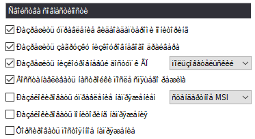
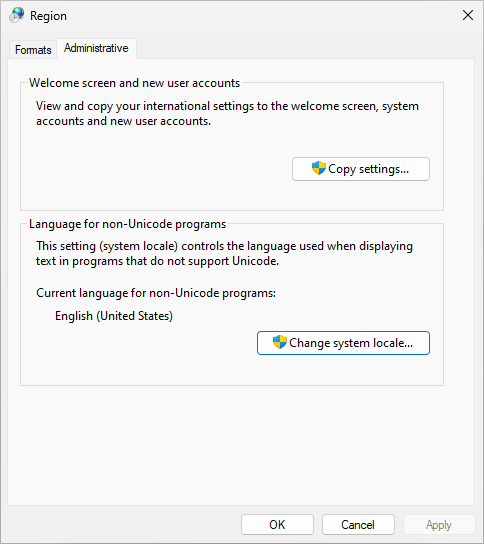

If your text looks like how it is on the picture below...

... you need to change the `Language for non-Unicode fonts` in the `Region` settings.

You can find it either in the Control Panel, or by just seaching for it in the Start Menu.

When after opening it change to the `Administrative` tab. It will look like this.

Here open the `Change system locale...` menu, then select your language. And check the option `Beta: Use Unicode UTF-8 for worldwide language support`.